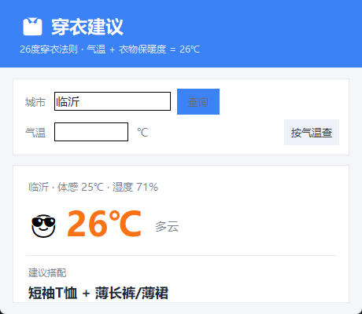

# 穿衣建议 · 26度穿衣法则

根据当日气温，自动给出成套穿衣建议的小工具。核心原理是流行已久的「26度穿衣法则」：

> **当日气温 + 衣物保暖度 = 26℃（人体体感舒适温度）**

本项目提供两个版本：

| 文件 | 说明 |
|------|------|
| `dressing_app.py` | 桌面 GUI 版（tkinter），双击运行、界面友好 |
| `dressing_advice.py` | 命令行版，标准库实现、无第三方依赖（联网时同展示风力/紫外线/湿度） |

## 功能特性

- 联网获取指定城市实时天气（wttr.in 免费接口，无需 API Key）
- 同时展示**风力风向**（蒲福风级）与**紫外线强度**（晒不晒，分级变色），以及湿度
- 按温度区间直接给出**成套穿衣搭配**（非硬凑数值）
- 小贴士动态补充：有雨带伞、大风防风、强紫外线防晒
- 支持手动输入气温，离线也能用
- 温度随区间变色 + 表情提示（🥵😎🙂🍂🧥❄️🥶🧊）
- 平时不驻留后台，关闭窗口即彻底退出、释放内存

## 穿衣区间对照

| 气温 | 建议搭配 |
|------|---------|
| ≥ 28℃ | 短袖T恤 + 短裤/短裙 |
| 24–27℃ | 短袖T恤 + 薄长裤/薄裙 |
| 20–23℃ | 短袖T恤 + 薄外套 |
| 16–19℃ | 长袖衬衫/薄卫衣 + 薄外套/风衣 |
| 11–15℃ | 毛衣/针织衫 + 风衣/薄外套 |
| 6–10℃ | 毛衣 + 棉服/夹克 |
| 1–5℃ | 保暖内衣 + 毛衣 + 棉服/薄羽绒服 |
| ≤ 0℃ | 保暖内衣 + 厚毛衣 + 厚羽绒服/呢大衣 |

## 快速开始

### 命令行版

```bash
python dressing_advice.py             # 获取默认城市（临沂）气温
python dressing_advice.py --city 北京  # 指定城市
python dressing_advice.py 18          # 手动指定气温
```

### 桌面 GUI 版

```bash
python dressing_app.py
```

双击运行即可，默认查询「临沂」，可在界面中改城市或手动输入气温。查询结果会展示当地气温、风力风向、紫外线（晒不晒）与湿度，并给出成套穿衣建议。

## 打包成独立 exe

GUI 版可用 PyInstaller 打包成单文件、无控制台的桌面程序：

```bash
pip install pyinstaller
pyinstaller --noconfirm --onefile --windowed --name DressingAdvice dressing_app.py
```

生成的可执行文件在 `dist/` 目录下，无需安装 Python 即可运行。

## 界面预览



## 说明

- 城市默认值可在代码顶部 `DEFAULT_CITY` 修改。
- 穿衣建议仅供参考，请结合体感与实际天气增减衣物。
- 自动获取气温依赖 wttr.in 服务，需联网。

## License

MIT
